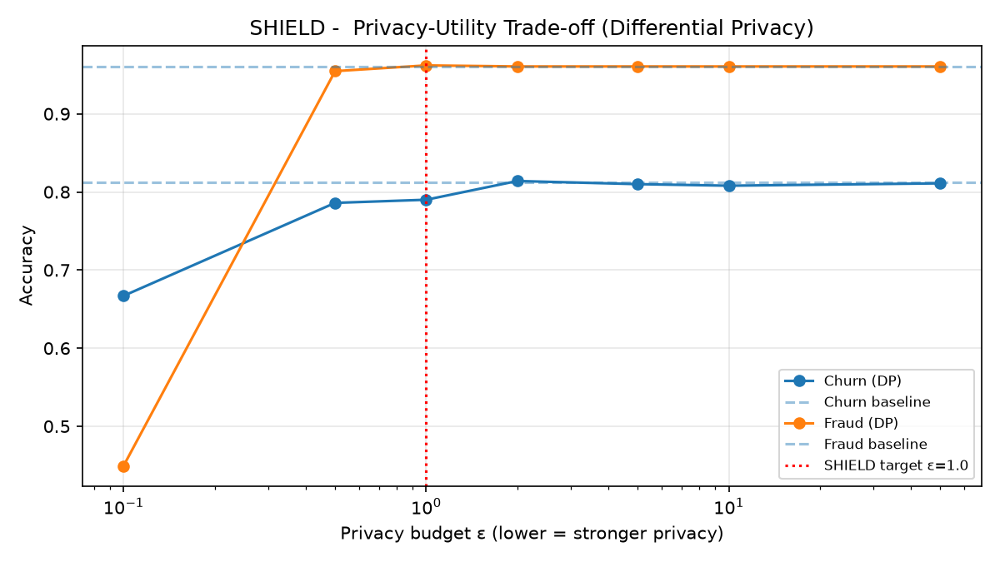
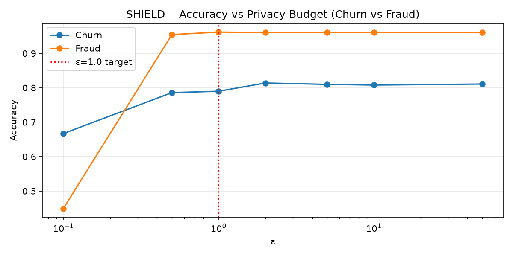
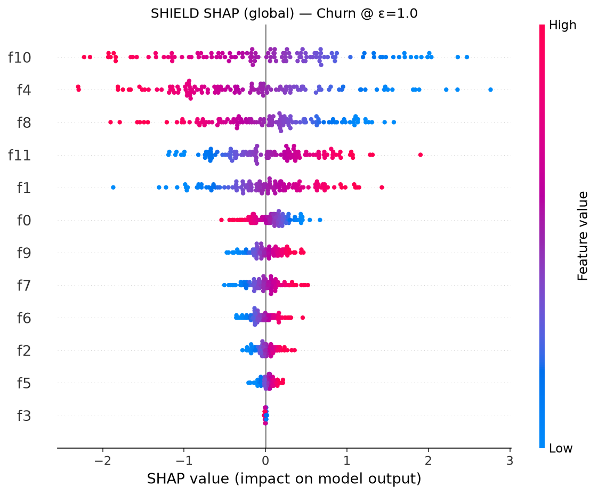
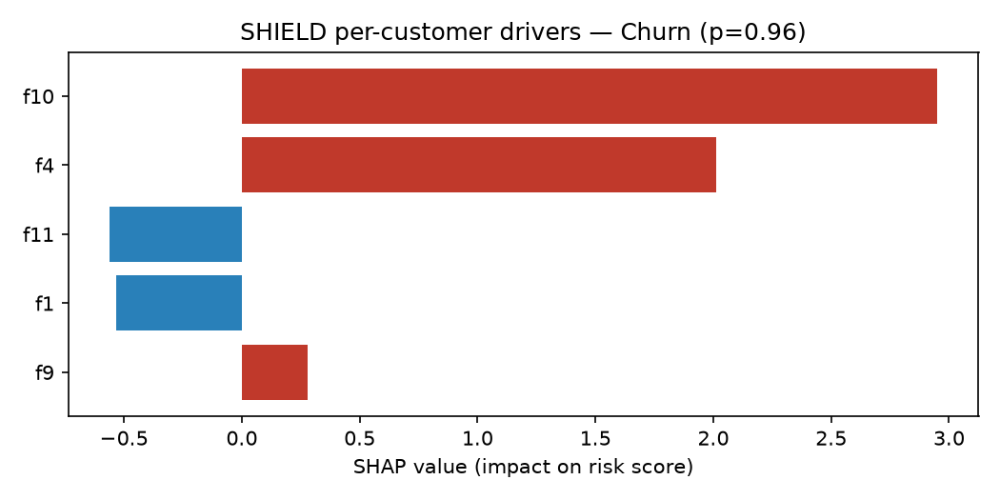
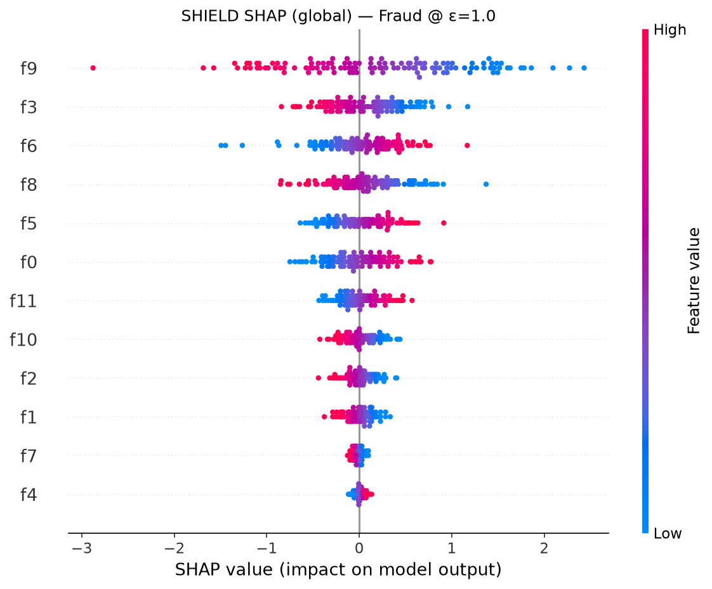
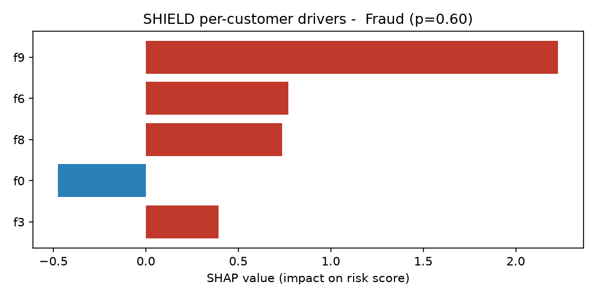
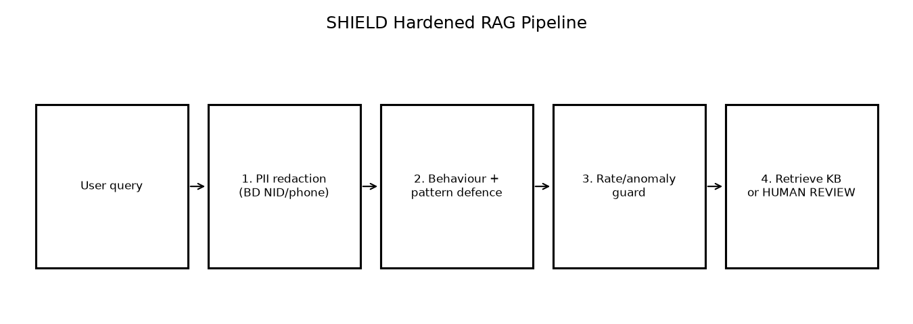
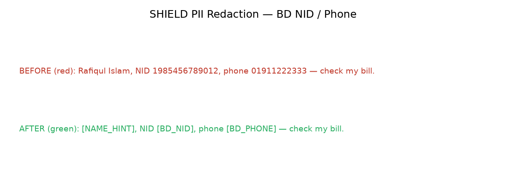
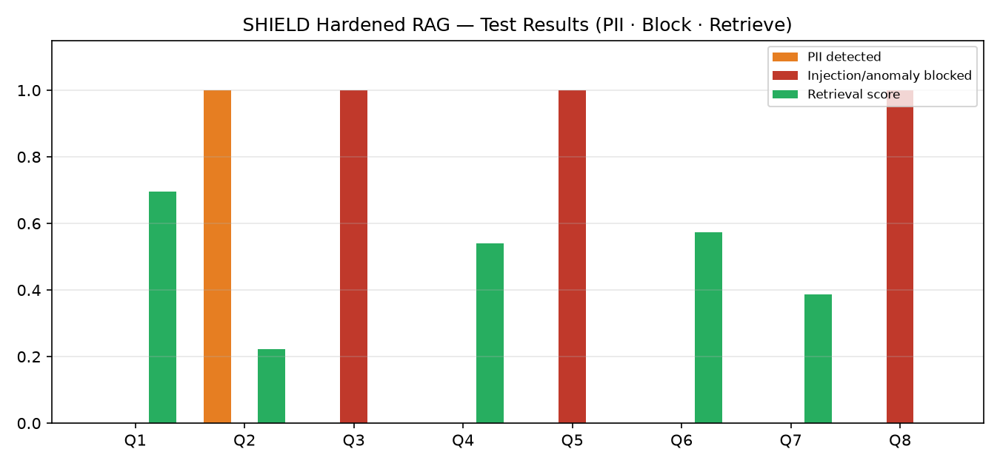

# SHIELD Framework
### Secure · Hardened · Integrity · Explainable · Lawful · Defended

**New Telecom Ltd Case Study | Robi Data Privacy Avengers Competition**

> **SHIELD** is a full-stack **privacy-without-friction** framework for telecom AI under Bangladesh **PDPA 2026**.  
> It combines **executive-ready governance** with **runnable technical demos**—going beyond demo-only notebooks *and* beyond policy-only essays.

| Layer | What SHIELD delivers |
|---|---|
| **Strategy** | 1-page concept paper + proposed target architecture (children, customer trust, DPO, third parties) |
| **Demo A** | Differential Privacy + SHAP for churn & fraud (ε≈1.0 operating point + customer reason drivers) |
| **Demo B** | Hardened RAG support assistant: BD PII redaction → behaviour+pattern defence → anomaly guard → retrieve / human review |

---

## Why SHIELD (vs a demo-only pack)

| Gap in typical AI demos | SHIELD answer |
|---|---|
| No children’s PDPA controls | Age assurance; if uncertain → no profiling; suppress under-18s in marketing/churn |
| Explainability only for data scientists | SHAP **plus** customer reason codes, appeal, fast fraud unblock |
| Regex-only prompt filters | Behaviour score + patterns + rate/anomaly guard + human handoff |
| No inclusion | Privacy dashboard **and** USSD/IVR/SMS/retail |
| No accountability story | Independent DPO (veto) + AI & Privacy Council + RACI |
| No Bangladesh localisation | NID, +880/01X phone, Bangla-aware customer channels |

---

## Repository structure

```
SHIELD-Framework/
├── README.md
├── requirements.txt
├── LICENSE
├── docs/
│   ├── SHIELD_Architecture.md
│   └── TeamNullX_ConceptPaper.pdf      # competition 1-pager (rename team if needed)
├── demos/
│   ├── demo_a_dp_shap.py               # DP privacy–utility + SHAP
│   └── demo_b_hardened_rag.py          # Hardened RAG pipeline
├── notebooks/                          # optional Jupyter wrappers
└── images/                             # generated plots
```

---

## Quick start

```bash
python3 -m venv .venv
source .venv/bin/activate
pip install -r requirements.txt

# Demo A — Differential Privacy + SHAP
python demos/demo_a_dp_shap.py

# Demo B — Hardened RAG
python demos/demo_b_hardened_rag.py
```

Plots are written to `images/`.

---

## Demo A — Privacy-preserving & explainable AI

**Questions answered**

1. Can we train on customer-like data **without memorising individuals?** → **Differential Privacy** (ε budget).  
2. Can we explain a high-risk decision to a customer/regulator? → **SHAP** + plain-language **reason codes**.

**Method:** baseline logistic regression vs ε-calibrated DP-style logistic regression (objective-perturbation / coefficient noise demo) across ε ∈ {0.1 … 50}; SHIELD production target **ε ≈ 1.0**. Swap in production DP-SGD / `diffprivlib` when deploying.

**Results**

Privacy–utility trade-off (lower ε = stronger privacy; red line = SHIELD target ε≈1.0):



Churn vs fraud accuracy across privacy budgets:



SHAP global drivers — churn:



SHAP per-customer reason drivers — churn (feeds customer reason codes / appeals):



SHAP global drivers — fraud:



SHAP per-customer reason drivers — fraud:



> Datasets: synthetic telco/fraud-style data by default (always runs). Drop CSVs into `data/` to use your own.

---

## Demo B — Hardened RAG customer support

```
User query
   → 1. PII redaction (BD NID / phone / name hints)
   → 2. Behaviour score + injection pattern filter
   → 3. Rate / exfiltration anomaly guard
   → 4. Retrieve from approved KB  OR  BLOCK + human review
```

**Upgrades vs keyword-only filters:** behaviour heuristics, session anomaly signals, explicit **human handoff** messaging (dial 121 / “agent”), PDPA-aware KB snippets (marketing opt-out, children’s rule, appeal path).

**Pipeline**



**PII redaction (BD NID / phone)**



**Test results** — legitimate answers vs injection/anomaly blocks:


---

## OWASP LLM Top 10 & ATLAS alignment (priority)

| Risk | ID | SHIELD control | Demo |
|---|---|---|---|
| Prompt Injection | LLM01 | Behaviour + patterns + anomaly guard + human review | B |
| Sensitive Disclosure | LLM02 | BD-localised PII redaction before retrieve/log | B |
| Training-data leakage | — | Differential Privacy (ε policy) | A |
| Opaque / unfair decisions | — | SHAP + reason codes + appeal path (architecture) | A + docs |
| Supply chain | — | AIBOM / signed models / no-train-on-our-data (architecture) | docs |

Also referenced in architecture: **MITRE ATLAS** adversarial ML testing alongside classical VAPT + AI red team.

---

## SHIELD — Proposed target architecture (summary)

Full detail: [`docs/SHIELD_Architecture.md`](docs/SHIELD_Architecture.md)

**One-liner:** Zero Trust + isolated AI zone + ABAC/JIT + encrypted DB + Hardened RAG + DP/SHAP + **privacy without friction** (dashboard + USSD/IVR, fast fraud unblock, customer KPIs) + children’s PDPA controls + DPO/Council + in-country default — **no blockchain / no public GenAI with personal data**.

---

## Competition artifact

- Concept paper (1 A4): `docs/TeamNullX_ConceptPaper.pdf`  
- Rename to `YourTeamName_ConceptPaper.pdf` before form upload.

---

## Research & standards (selected)

1. Abadi et al. (2016) — Deep Learning with Differential Privacy (ACM CCS).  
2. Lundberg & Lee (2017) — SHAP (NeurIPS).  
3. Greshake et al. (2023) — Prompt injection (AISec@CCS).  
4. Chen et al. (2025) — StruQ structured queries (USENIX Security) — *roadmap*.  
5. OWASP Top 10 for LLM Applications (2025).  
6. ISO/IEC 42001 (AI MS) & ISO/IEC 27701 (privacy MS) — *alignment targets*.  
7. Bangladesh Personal Data Protection Act, 2026 (PDPA).

---

## Team

Built for **Robi Data Privacy Avengers** — New Telecom Ltd case.  
Framework name: **SHIELD**. Tagline: **Privacy without friction.**

---

## License

MIT — see `LICENSE`.
